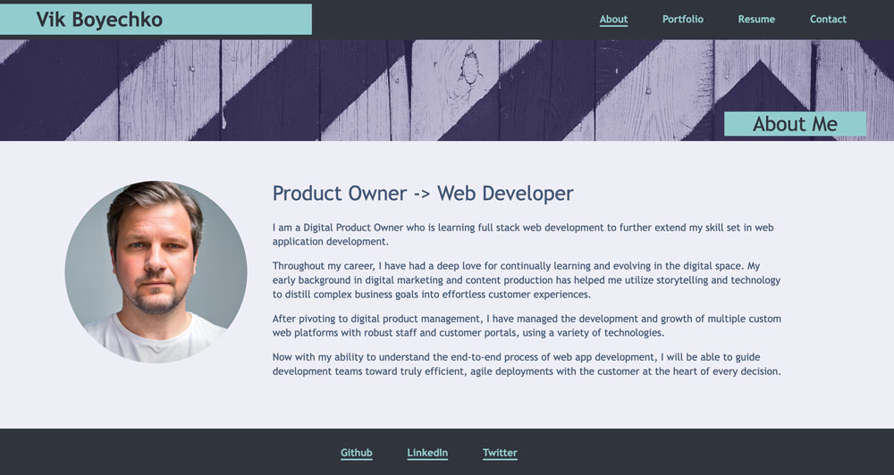

# React Portfolio

This project showcases my web development portfolio using React, Vite, Bootstrap, along with JavaScript, HTML and CSS. The goal was to create a modular, responsive, and lightweight website with reusable React components.

[Deployed site on Netlify](https://vikboyechko.netlify.app)

